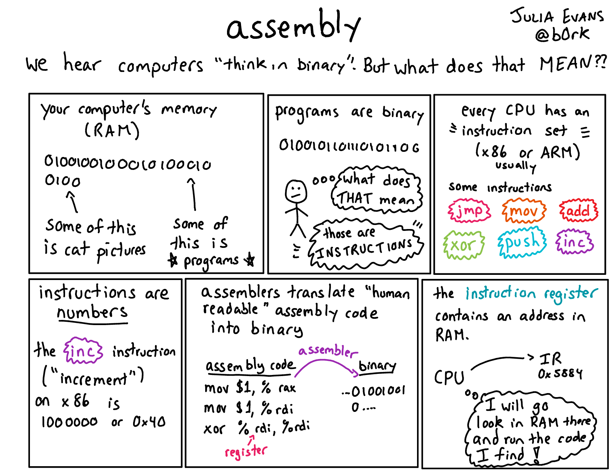

# Writing a C Compiler

Following the tutorial `https://norasandler.com/2017/12/15/Write-a-Compiler-3.html` <br>
Picture from `https://drawings.jvns.ca/assembly/`



## What I will learn

- ASTs, linters, static analyzers, metaprogramming
- assembly, calling conventions, low level

## What it will conver

- arithmetic operations
- conditionals
- local variables
- function calls
- etc.

## Week 1: Integers

- will use our compiler to produce x86 assembly
- then use gcc to convert it to executable (the assembled and the linker do that)

```s
	.section	__TEXT,__text,regular,pure_instructions
	.macosx_version_min 10, 13
	.globl	_main                   	## -- Begin function main
	.p2align	4, 0x90
_main:                                  ## @main
## BB#0:
	pushq	%rbp
	movq	%rsp, %rbp
	movl	$2, %eax
	popq	%rbp
	retq
                                        ## -- End function

.subsections_via_symbols
```

- `globl _main` means main should be visible to the linker (otherwise can't find entry point)

```s
_main:                  ; label for start of "main" function
    movl    $2, %eax    ; move constant "2" into the EAX register
    ret                 ; return from function
```

- when a function returns, the EAX register will contain its return value
- the `main` function's return value will be the program's exit code

### Strategy

- split the compiler into three stages:
    - lexing
	- parsing
	- code generation
	- this is pretty standard architecture, except you'd normally want a bunch of optimization passes between parsing and code generation

#### Lexing

- Breaks up a string (the source code) into a list of tokens
- Tokens are grouped in categories
- Examples: 
	- `int` keyword
	- Identifier `main`
	- Open paren, Close paren
	- Open brace, Close brace
	- `return` keyword
	- Semicolon
	- Constant `2`

#### Task

Write a `lex` function that accepts a file and returns a list of tokens. It should work for all stage 1 examples in the test suite. The invalid examples should raise errors in the parser, not the lexer. To keep things simple we only lex decimal integers.

#### Parsing

Write a parse function that accepts a list of tokens and returns an AST, rooted at a Program node. 

#### Code generation

### Week 3
Need to distinguish between `-` for negative and `-` for substraction.

AST for `2 - (-3)`:
```ocaml

two = Const(2)
three = Const(3)
neg_three = UnaryOperation(NEG, three)
exp = BinaryOperation(MINUS, two, neg_three)
```

#### 1. Need to take into account operator precedence:
- for example `*` has higher precendence than `+`
#### 2. Need to handle associativity: 
- for example `1 - 2 - 3` needs to be handled as `(1 - 2) - 3` and never as `1 - (2 - 3)`
#### 3. Needs to not be left recursive.
- for example in this ``` <expr> <binary_op> <expr> ``` the left-most term is also `<expr>` - this is not incorrect, but recursive descent parsers can't handle them.


#### 1. Operator precedence

- `unary` operators first, they have higher precedence than binary operators
- a `unary` operator should only be allpied to a whole expression if 
	- the expression is a single integer, eg `~4`
	- the expression is wrapped in parantheses, eg `~(1+1)`
	- the expression is itself a unary operation, eg `~!8`, `-~(2+2)` 

- to achieve this, we need another symbol to refer to `an expression a unary operator can be applied to`. call that a `factor`. update grammar:

```html
<exp> ::= <exp> <binary_op> <exp> | <factor>
<factor> ::= "(" <exp> ")" | <unary_op> <factor> | <int>
```

- also, to handle `*` and `/` correctly:

```html
<exp> ::= <exp> ("+" | "-") <exp> | <term>
<term> ::= <term> ("*" | "/") <term> | <factor>
<factor> ::= "(" <exp> ")" | <unary_op> <factor> | <int>
```

#### 2. Associativity
- the grammar above still does not handle associativity well
- we need to introduce the semantics `{ }` which means something can be repeated zero or more times:
```html
<exp> 		::= <term> { ("+" | "-") <term> }
<term> 		::= <factor> { ("*" | "/") <factor> }
<factor> 	::= "(" <exp> ")" | <unary_op> <factor> | <int>
```

Having done the parser for factors, terms and binary operations, now we need to implement them on the memory.

For the cpp:
```cpp
int main() { return 1 - 2 - 3; }
```
Parser return is:
```cpp
['int', 'main', '(', ')', '{', 'return', '1', '-', '2', '-', '3', ';', '}']
fun main
{
  returns: int
  params: ()
  body:
  return BinOp(Op(-), BinOp(Op(-), Nr(`1`), Nr(`2`)), Nr(`3`))
}
```

- Executing `2 + 3`
- we need to save at least the first operand the stack. we can't save them in registers because they can be overridden by other processing.

```
Every process on a computer has some memory. This memory is divided into several segments, one of which is the call stack, or just the stack. The address of the top of the stack is stored in the ESP register, aka the stack pointer. Like with most stacks, you can push things onto the top, or pop things off the top; x86 includes push and pop instructions to do just that. One confusing thing about the stack is that it grows towards lower memory addresses – when you push something onto the stack, you decrement ESP. The processor relies on ESP to figure out where the top of the stack is.
```

- about registers:
`https://wiki.skullsecurity.org/index.php?title=Registers`
- there are 8 of them

- finished up example:
```cpp
int main() {
    return 10 / 3 + 
            6 * 3 - 
            (2+3) + 
            (5-1) + 
                1 + 
                1;
}
```

```s
.globl _main
_main:
        movl    $2, %eax
        pushl   %eax
        movl    $3, %eax
        popl    %ecx
        addl    %ecx, %eax
        pushl   %eax
        movl    $3, %eax
        pushl   %eax
        movl    $10, %eax
        popl    %ecx
        movl    $0, %edx
        idivl   %ecx
        pushl   %eax
        movl    $6, %eax
        pushl   %eax
        movl    $3, %eax
        popl    %ecx
        imul    %ecx, %eax
        popl    %ecx
        addl    %ecx, %eax
        popl    %ecx
        subl    %ecx, %eax
        pushl   %eax
        movl    $1, %eax
        pushl   %eax
        movl    $5, %eax
        popl    %ecx
        subl    %ecx, %eax
        popl    %ecx
        addl    %ecx, %eax
        pushl   %eax
        movl    $1, %eax
        popl    %ecx
        addl    %ecx, %eax
        pushl   %eax
        movl    $1, %eax
        popl    %ecx
        addl    %ecx, %eax
        ret

```


### To further search:
- linters, static analyzers, and metaprogramming